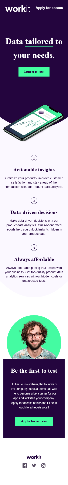

# Frontend Mentor - Workit Landing Page Solution

This is a solution to the [Workit landing page challenge on Frontend Mentor](https://www.frontendmentor.io/challenges/workit-landing-page-2fYnyle5lu).

## Table of contents

* [Overview](#overview)

  * [The challenge](#the-challenge)
  * [Screenshot](#screenshot)
  * [Links](#links)
* [My process](#my-process)

  * [Built with](#built-with)
  * [What I learned](#what-i-learned)
  * [Continued development](#continued-development)
  * [Useful resources](#useful-resources)
* [Author](#author)
* [Acknowledgments](#acknowledgments)

## Overview

### The challenge

Users should be able to:

* View the optimal layout for the interface depending on their device's screen size
* See hover and focus states for all interactive elements on the page

### Screenshot

### Links

* Live Site URL: [https://yourusername.github.io/workit-landing-page](https://yourusername.github.io/workit-landing-page)
* Repository URL: [https://github.com/siryazy/Workit-landing-page](https://github.com/siryazy/Workit-landing-page)

## My process

### Built with

* Semantic HTML5 markup
* CSS3 (custom properties, Flexbox, Grid, clip-path)
* Mobile-first workflow
* Google Fonts: **Fraunces** & **Manrope**

### What I learned

* Creating a curved header bottom using `clip-path` to match the design.
* Implementing a fully mobile-first responsive layout with media queries at **768px** and **1024px**.
* Using CSS Grid to switch between 1‑, 2‑, and 3‑column feature sections.
* Managing z‑index and positioning for overlapping elements (hero image, patterns).

### Continued development

* Enhance accessibility: add keyboard focus states, ARIA labels, and better contrast testing.
* Explore fluid typography with the `clamp()` function for smoother scale across breakpoints.
* Add subtle animations or transitions (e.g., CSS keyframes or GSAP) to bring the page to life.

### Useful resources

* [CSS clip-path guide](https://bennettfeely.com/clippy/) – Interactive tool for generating clip-path shapes.
* [MDN Media Queries](https://developer.mozilla.org/en-US/docs/Web/CSS/Media_Queries) – Reference for writing responsive breakpoints.

## Author

* Yazy
* Portfolio: [ziryazy.vercel.app](https://ziryazy.vercel.app)
* GitHub: [@siryazy](https://github.com/siryazy)
* Twitter: [@siryazy](https://x.com/siryazy)

## Acknowledgments

* Thanks to **Frontend Mentor** for the design challenge.
* Appreciation to my friend for sharing the premium assets for educational use.
